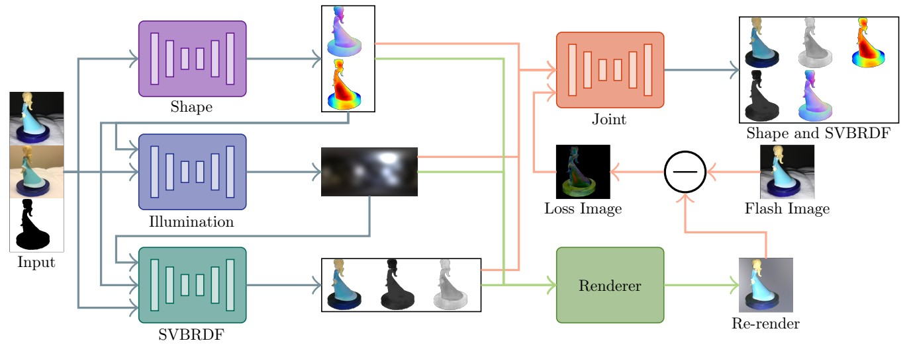

# Two-shot Spatially-varying BRDF and Shape Estimation

### [Project Page](https://markboss.me/publication/cvpr20-two-shot-brdf/) | [Video](https://www.youtube.com/watch?v=CyC6PutoJO8) | [Paper](https://arxiv.org/abs/2004.00403) | [Data](https://drive.google.com/file/d/14mou3Va65deimPYE5GtFdK8OS3I0BSzq/view?usp=sharing)

Tensorflow implementation using [Tensorpack](https://github.com/tensorpack/tensorpack) for predicting the shape, illumination and BRDF of an object using two handheld images.
<br>
[Two-shot Spatially-varying BRDF and Shape Estimation](https://markboss.me/publication/cvpr20-two-shot-brdf/)
[Mark Boss](https://markboss.me)<sup>1</sup>, [Varun Jampani](https://varunjampani.github.io)<sup>2</sup>, [Kihwan Kim](http://kihwan23.com)<sup>2</sup>, [Hendrik P. A. Lensch](https://uni-tuebingen.de/en/faculties/faculty-of-science/departments/computer-science/lehrstuehle/computergrafik/computer-graphics/staff/prof-dr-ing-hendrik-lensch/)<sup>1</sup>, [Jan Kautz](http://jankautz.com)<sup>2</sup>
<sup>1</sup>University of Tübingen, <sup>2</sup>NVIDIA 
<br>


## License

Copyright (C) 2020 NVIDIA Corporation. All rights reserved.

This work is made available under the [NVIDIA Source Code License](LICENSE).

## Setup

This project uses [Pipenv](https://pipenv-fork.readthedocs.io/en/latest/) for dependency management. 

```
pipenv install
pipenv shell
```

You are now in the correct virtual environment shell. 

## Inference

As the weights are comparably small, they are included in the weights directory of this git. This git also includes an `inference_images` folder. You can places images inside the example folder, where each sample is placed in its folder.

Performing an inference on own data is then performed with the `infer.py` script:

```
python infer.py --data inference_images -s weights/shape_graph.pb -i weights/illumination_graph.pb -b weights/brdf_graph.pb -j weights/joint_graph.pb --gpu 0
```

Notice that per default, a Low Dynamic Range sRGB image is expected. If the data is available in linear color space or High Dynamic Range format, the `--linear` or `--hdr` option can be used respectively.

## Training

Performing full retraining is due to the sequential nature of the pipeline, also a sequential process. Each network first needs to be trained, then a complete inference step on the dataset needs to be executed. 

**If not already done, download the [dataset](https://drive.google.com/file/d/14mou3Va65deimPYE5GtFdK8OS3I0BSzq/view?usp=sharing) first and extract it.**

```
python train_stage.py shape --data PATH_TO_DATASET/training --save TRAINDIR/brdf --gpu 0
python advance_stage.py shape --data PATH_TO_DATASET/training -w TRAINDIR/brdf/compact.pb --gpu 0

python train_stage.py illumination --data PATH_TO_DATASET/training --save TRAINDIR/illumination --gpu 0
python advance_stage.py illumination --data PATH_TO_DATASET/training -w TRAINDIR/illumination/compact.pb --gpu 0

python train_stage.py brdf --data PATH_TO_DATASET/training --save TRAINDIR/brdf --gpu 0
python advance_stage.py brdf --data PATH_TO_DATASET/training -w TRAINDIR/brdf/compact.pb --gpu 0

python train_stage.py joint --data PATH_TO_DATASET/training --save TRAINDIR/joint --gpu 0
python advance_stage.py joint --data PATH_TO_DATASET/training -w TRAINDIR/joint/compact.pb --gpu 0
```

After the training is done a `compact.pb` file exists in the specified training directory. This file can then be used for the inference.

## Configuration

Each stage of the training can be altered using command line parameters. Consult the `--help` option of the `train_stage.py` script for a detailed explanation. Additionally, the render config can be altered in the `config/render_config.json` file.

## Citation

```
@inproceedings{Boss2020-TwoShotShapeAndBrdf,
    author = {Boss, Mark and Jampani, Varun and Kim, Kihwan and Lensch, Hendrik P.A. and Kautz, Jan},
    title = {Two-shot Spatially-varying BRDF and Shape Estimation},
    booktitle = {IEEE Conference on Computer Vision and Pattern Recognition (CVPR)},
    year = {2020}
}
```